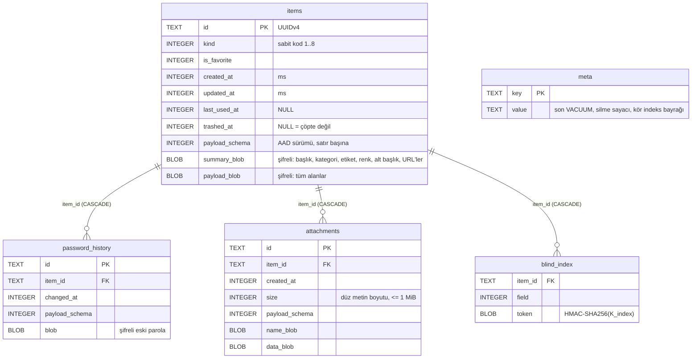

# Quanta — Veri Katmanı (Aşama 2)

Kapsam: domain, repository ve servis katmanı. **UI yoktur.** Aşama 1 API'si (`VaultService`,
`VaultSession`, `RecordCipher`, `VaultKeys`…) bozulmadı; yalnızca **eklemeler** yapıldı:
`CryptoLabels` yeni etiketler, `VaultKeys.db` (K_db) alanı.

> **Doğrulama durumu (dürüst not):** Bu ortamda Dart/Flutter yoktu; kod **derlenmedi ve testler
> çalıştırılmadı**. Bağımsız olarak doğrulananlar: RFC 6238 vektörleri (Python HMAC), ki-kare
> kritik değerleri (scipy), HChaCha20 RFC taslağı vektörü ve `.quanta` v1 fixture'ı (Python referans
> uygulaması, `tool/gen_backup_fixture.py`). İlk iş: `flutter pub get && flutter analyze && flutter test`.

## 1. Katmanlar ve dosyalar

```
lib/core/storage/        şema, drift DB (QuantaDatabase), SQLCipher açıcı, güvenli silme, meta, başlık deposu
lib/core/util/           CSPRNG tamsayı (bias'sız), Base32, Türkçe arama katlama, UUID, URL ana makinesi
lib/features/vault/
  domain/                modeller, filtre, VaultRepository arayüzü
  data/                  ItemCodec, SearchIndex (bellek), DriftVaultRepository
  services/              VaultManager (yaşam döngüsü), MaintenanceService (VACUUM), provider
lib/features/totp/       RFC 6238, otpauth, QR arayüzü
lib/features/generator/  rastgele / diceware / PIN
lib/features/audit/      çevrimdışı güvenlik denetimi
lib/features/backup/     .quanta biçimi ve servisi
lib/features/import_export/  CSV kodeği, içe aktarıcılar, akış, düz CSV dışa aktarım
```

**Neden drift kod üretimsiz?** Şema `lib/core/storage/schema.dart` içinde düz SQL'dir ve
`GeneratedDatabase` alt sınıfı elle yazılmıştır (tablo sınıfı/`build_runner` yok). Gerekçe: bu ortamda
kod üretimi çalıştırılamadı; ayrıca güvenlik açısından kritik DDL ve `randomblob` ile ezme satırları
doğrudan denetlenebilir. drift'in yürütücüsü (SQLCipher dâhil), transaction ve `MigrationStrategy`
mekanizmaları kullanılır. Reaktif akışlar drift tablo akışlarıyla değil, depo düzeyinde değişiklik
bildirimiyle (birleştirmeli, sıralı) sağlanır.

## 2. Savunma katmanları (üç katman)

| # | Katman | Anahtar | Ne korur |
|---|--------|---------|----------|
| 1 | Alan bazlı kaskad (aşama 1): XChaCha20-Poly1305 ⊂ AES-256-GCM, AAD = (kayıt kimliği, payload şema sürümü, alan) | K_inner, K_outer | her hassas blob |
| 2 | SQLCipher (AES-256, sayfa HMAC) | **K_db = HKDF-SHA512(VMK, "quanta/v1/db")** | tüm DB dosyası + metadata |
| 3 | Kasa başlığı: Argon2id ile türetilen KEK + Secret Key (+ opsiyonel key file) sarmalı VMK | KEK | VMK |

SQLCipher'a **ham anahtar** verilir: `PRAGMA key = "x'<64 hex>'"` (PBKDF2 atlanır; anahtar zaten yüksek
entropili). Bağlantı açılışında: `cipher_memory_security=ON`, `secure_delete=ON`, `foreign_keys=ON`.
`PRAGMA cipher_version` boşsa (SQLCipher yüklenmemiş) açılış **reddedilir** — sessizce düz SQLite'a düşmek yok.

**Başlık dosyası** (`vault.header`) DB'nin **dışındadır** (K_db ancak başlıkla açılan VMK'dan türer).
Yazım atomik: `.tmp` → flush → eski `.bak` → rename. `.bak` otomatik kullanılmaz (geri alma saldırısı).

Bilinen sınırlar: hex anahtar dizgisi Dart `String`'i olarak sıfırlanamaz ve arka plan isolate'ına
kopyalanır; Dart `String` içerikli bellek indeksi sıfırlanamaz, yalnızca referanslar bırakılır.

## 3. Şema (v2)



Düz sütunlar yalnızca yapısal metadata'dır (tür, favori, zamanlar). Başlık, kategori, etiket, renk,
not, kullanıcı adı, URL, parola vb. **hiçbiri düz sütunda değildir**. (Düz sütunlar blob AAD'sine
girmez; bu sütunları değiştirmek için SQLCipher anahtarı gerekir — katman 2.)

### Blob düzeni ve AAD
Her blob = aşama 1 `RecordCipher` çıktısı. AAD: `recordId`, `payload_schema`, `field`.

| Blob | recordId | field |
|------|----------|-------|
| `items.payload_blob` | `<itemId>` | `payload` |
| `items.summary_blob` | `<itemId>` | `summary` |
| `password_history.blob` | `<itemId>/ph/<historyId>` | `password` |
| `attachments.name_blob` | `<itemId>/att/<attId>` | `att_name` |
| `attachments.data_blob` | `<itemId>/att/<attId>` | `att_data` |

Blob başka kayda/alana taşınırsa açılmaz (test: `repository_test`). `payload_schema` **DB şema
sürümünden bağımsızdır**: DB migration'ı blob yeniden şifrelemeyi gerektirmez; eski satırlar okunurken
yükseltilir ve bir sonraki yazımda güncel sürümle yazılır.

### Payload JSON (v1)
```json
{"v":1,"kind":"login","title":"…","category":null,"tags":[],"color":null,"notes":"",
 "custom":[{"n":"PIN","v":"4321","t":"hidden"}],"secretChangedAt":1760000000000,
 "data":{"username":"…","password":"…","urls":[],"totp":"otpauth://…"}}
```
Türler: `login, card, note, wifi, identity, api_key, ssh_key, custom` (kodlar 1–8, **asla yeniden numaralanmaz**).
Her kayıtta ortak: kategori, favori, etiketler, renk, notlar, özel alanlar, oluşturma/güncelleme/son kullanım/çöp zamanı.

## 4. Migration
`MigrationStrategy`: `onCreate` = v1…current adımları; `onUpgrade` = yalnızca eksik adımlar.
v1 → v2: `blind_index` + `idx_items_trashed`. Daha yeni şemalı DB `newerSchema` ile reddedilir.
Testler: v1→v2 veri korunur; **yükseltilmiş şema == sıfırdan şema** (`sqlite_master` karşılaştırması).
Yeni sürüm eklerken: `Schema.current++`, `stepStatements`'e yeni `case`, testlere v(n-1)→v(n) ekleyin.

## 5. Güvenli silme
1. Satır (ve çocuk satırlar: geçmiş, ekler, kör indeks) blob'ları `randomblob(length(x))` ile **ezilir**,
2. sonra `DELETE`; `PRAGMA secure_delete=ON` bağlantıda açıktır,
3. silme sayacı `meta`'ya yazılır; `MaintenanceService.vacuumIfDue()`: sayaç ≥ 25 **veya** (≥1 silme ve son
   VACUUM ≥ 7 gün) ise `VACUUM`. Uygulama bunu kilit açılışında/zamanlayıcıyla çağırır (`VaultManager.runMaintenance`).

Dürüst sınır: SQLite kopya-yazma ve flash aşınma dengeleme eski blokları fiziksel olarak bırakabilir; bu
katman SQLCipher + alan şifrelemesinin **üstüne ek önlemdir**, tek başına fiziksel silme garantisi değildir.
Diskteki her şey zaten şifreli metindir.

## 6. Çöp kutusu ve parola geçmişi
- `trash` → `trashed_at`; `restore` → NULL; `purgeExpiredTrash()` 30 gün sonra güvenli siler (kilit açılışında otomatik).
- Birincil sır (login/Wi-Fi parolası, API anahtarı) değişirse eski değer şifreli geçmişe eklenir; en fazla **10**, fazlası güvenli silinir.
- `update` kimlik, tür, oluşturma/son kullanım/çöp zamanlarını **depodakinden** korur (bayat nesne ezmesin).

## 7. Arama
- **Bellek içi indeks** (`SearchIndex`): kilit açılınca şifreli `summary_blob`'lardan kurulur (başlık, alt başlık/kullanıcı adı,
  URL'ler, etiketler, kategori); `close()`/kilitte boşaltılır. **Diske düz metin indeks yazılmaz.**
- Türkçe katlama (`İ/I/ı→i, ş→s, ğ→g, ü→u, ö→o, ç→c`); tüm sözcükler eşleşmeli; sıralama: başlıkta önek > başlıkta içerme > diğer.
- **Opsiyonel kör indeks** (varsayılan KAPALI, `setBlindIndexEnabled`): `token = HMAC-SHA256(K_index, "<alan>\0<katlanmış terim>")`,
  alanlar `username, host, title, tag`; yalnızca **tam eşleşme** (`findByExact`). Sızıntı: eşitlik/frekans örüntüsü (aynı kullanıcı adı
  birden çok kayıtta). Bellek indeksi zaten tam eşleşmeyi sağladığından bu özellik esas olarak kilit açılışında özet çözmeden
  eşleşme gerektiren senaryolar içindir.

## 8. TOTP
RFC 6238/4226: SHA1/SHA256/SHA512, 6–8 hane, **30 veya 60 sn** (başka periyotlar `FormatException`; `TotpConfig.allowedPeriods` ile genişletilir).
`otpauth://totp/...` ayrıştırma/üretme (issuer/etiket önceliği: `issuer` parametresi > etiket öneki), HOTP reddedilir, sır ≥ 10 bayt.
QR için yalnızca `QrScanner` arayüzü + `TotpQrImporter` (kamera/UI sonra). Google Authenticator `otpauth-migration://` desteklenmiyor.
LoginData TOTP'yi `otpauth://` URI olarak saklar (içinde algoritma/hane/periyot var).

## 9. `.quanta` yedek biçimi v1

Hepsi big-endian. Referans uygulama: `tool/gen_backup_fixture.py` (Dart'tan bağımsız).

```
off  len  alan
0    4    magic "QNTB"
4    1    formatVersion = 1
5    1    flags = 0          (v1'de sıfır olmak zorunda)
6    8    createdAtMs
14   4    kdf.memoryKiB
18   4    kdf.iterations
22   1    kdf.parallelism
23   1    kdf.hashLength = 32
24   1    saltLength = 16
25   16   salt                                  ┐ başlık = ilk 41 bayt
41   12   outerNonce
53   N    outerCiphertext  (AES-256-GCM)
53+N 16   outerTag
..   32   mac = HMAC-SHA256(K_mac, header(41) | outerNonce | outerCt | outerTag)
```
Anahtarlar:
```
pwKey   = Argon2id(utf8(yedekParolası), salt, memoryKiB, iterations, parallelism) -> 32 B
K_outer = HKDF-SHA512(pwKey, info="quanta/v1/backup-outer", salt=∅) -> 32 B
K_mac   = HKDF-SHA512(pwKey, info="quanta/v1/backup-mac",   salt=∅) -> 32 B
K_backup= HKDF-SHA512(VMK,   info="quanta/v1/backup")                (aşama 1: VaultKeys.backup)
```
Dış katman: `AES-256-GCM(K_outer, outerNonce, AAD = "quanta/v1/backup-file" | header(41))`.
Dış düz metin: `u16 vaultHeaderLen | vaultHeader | innerNonce(24) | innerCt | innerTag(16)`.
İç katman: `XChaCha20-Poly1305(K_backup, innerNonce, AAD = "quanta/v1/backup-inner" | header(41))`;
iç düz metin = UTF-8 JSON:
```json
{"format":1,"createdAt":…,"items":[{ …payload alanları…, "id":"…","favorite":false,"createdAt":…,"updatedAt":…,
  "lastUsedAt":null,"trashedAt":null,
  "history":[{"id","changedAt","setAt","password"}],
  "attachments":[{"id","name","createdAt","data":"<base64>"}] }]}
```
Okuma sırası: yapı/sürüm → **KDF politikası (Argon2'den önce, DoS/downgrade)** → Argon2id → MAC (sabit zamanlı) → dış AEAD → iç AEAD → JSON.
Hata türleri: `malformedData`, `unsupportedVersion`, `weakParameters`, `authenticationFailed` (yanlış parola ile kurcalama ayırt edilemez, bilerek).

**İki sır gerekir:** iç katman K_backup ister (VMK'dan). Yedek dosyası kasa başlığını da içerir; yeni cihazda
`BackupService.openAsNewVault` yedek parolası + ana parola + Secret Key (veya mevcut açık oturum) ile açar.
Yedekteki başlık yedek **alındığı andaki** ana parolayı sarar (sonradan parola değiştiyse eski parola gerekir).
Sıkıştırma yoktur (sıkıştırma+şifreleme yan kanalı). Dosya boyutu kayıt sayısını sızdırır.

`verify` (restore etmeden): `inspect` (parolasız yapı), `verify(password)` (MAC + dış katman), `verify(password, keys)` (iç katman + kayıt sayıları).
Geri uyumluluk: `test/fixtures/backup_v1.quanta` altın dosyası her sürümde açılmalıdır.

## 10. İçe aktarma / dışa aktarma
- Kaynaklar: Bitwarden JSON (şifresiz; şifreli export reddedilir) ve CSV, KeePass(XC)/eski KeePass CSV, Chrome CSV, 1Password CSV
  (başlık takma adlarıyla). Desteklenmeyen türler (ör. kredi kartı CSV'si) satır numarasıyla raporlanır; **hata mesajları sır içermez**.
- Çakışma parmak izi: login → (başlık, kullanıcı adı, ilk URL ana makinesi), diğerleri → (tür, başlık); Türkçe katlamalı.
  Politikalar: `skip`, `overwrite` (güncelle; eski parola geçmişe), `duplicate` (başlığa " (kopya)"). Dosya içi yinelenenler de çakışmadır.
- **Düz dosya akışı** (`ImportFlow`): `preview → apply → shredSource | keepSourceAcknowledged → finished`. Karar verilmeden akış bitmez.
  `PlaintextShredder` en iyi çabadır (rastgele ez + sil); flash/SAF/bulut kopyaları nedeniyle garanti değildir; `PlaintextAdvisory` UI'da gösterilmelidir.
- **Düz CSV dışa aktarım** (`PlainExportService`): `authorize` = açık risk onayı + ana kimlik bilgilerinin **yeniden girişi** (başlıkla açılır,
  açık oturumla aynı kasa olmalı) → tek kullanımlık, 2 dk geçerli yetki → `exportCsv`. Dosya yazılmaz, bayt döner; çöpteki kayıtlar hariç.
  Sütunlar: `type,title,category,favorite,tags,url,username,password,totp,notes,extra_json`. CSV formül enjeksiyonuna karşı hücre
  değiştirilmez (parola bozulmasın); Excel'de açmadan önce dikkat.

## 11. Güvenlik denetimi (çevrimdışı)
Zayıf (zxcvbn-benzeri skor < 3), **yaygın** (bundle edilmiş 10k parola Bloom filtresi), **tekrar** (HMAC parmak izi; düz parola tutulmaz),
**eski** (>1 yıl; `secretChangedAt`), **TOTP'siz ama destekleyen** (statik, en iyi çaba alan adı listesi), **boş alanlı**.
Skor = 100 − ortalama(kayıt cezası); cezalar: yaygın 100, zayıf 70/40, tekrar 50, eski 25, 2FA yok 10, boş 15 (kayıt başına en çok 100).
**İleride (şimdi eklenmedi):** isteğe bağlı HIBP k-anonymity (SHA-1 ilk 5 hex) sorgusu.

## 12. Parola üretici
Yalnızca `Csprng` (`Random.secure()`); `SecureRandomInt` modulo bias'ı **rejection sampling** ile giderir (2³² aralığı). Rastgele: 8–128,
sınıflar, benzer karakter hariç (`O0oIl1|`), her sınıftan ≥1 **rejection sampling ile** (kısıtlı kümede tekdüze; sınıf içi tam tekdüze,
sınıflar arası oran hafif kayar). Diceware: EFF büyük liste (7776, `tool/fetch_assets.sh`; sayı/tekillik doğrulanır), ayırıcı/büyük harf/sayı
seçenekleri. PIN: 4–12, trivial (aynı rakam, ardışık, tekrarlı blok) elenir.

## 13. Kilit sözleşmesi
Tüm depo metotları kilit açıkken çalışır; kilitliyken `Future` → `StateError`'lu başarısız Future, `Stream` metotları → senkron `StateError`.
`VaultManager.lock()` sırası: depo kapat (indeks sıfırla, akışlar biter) → DB kapat → oturum anahtarlarını sıfırla.

## 14. Testler
`flutter test` (host'ta sistem `libsqlite3` gerekir). Düz SQLite kullanan testler SQLCipher'a özgü davranışı **kapsamaz**:
SQLCipher yükleme, `PRAGMA cipher_version`, ham anahtarla açma ve yanlış anahtar reddi için cihaz/entegrasyon testi ekleyin.
